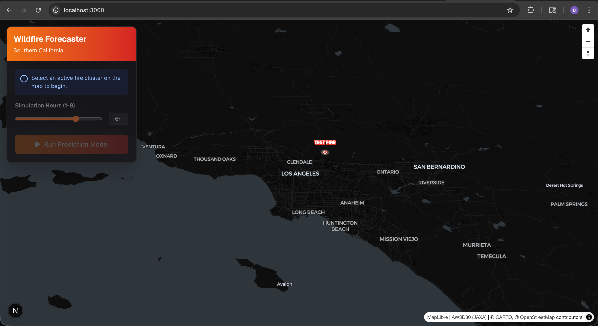
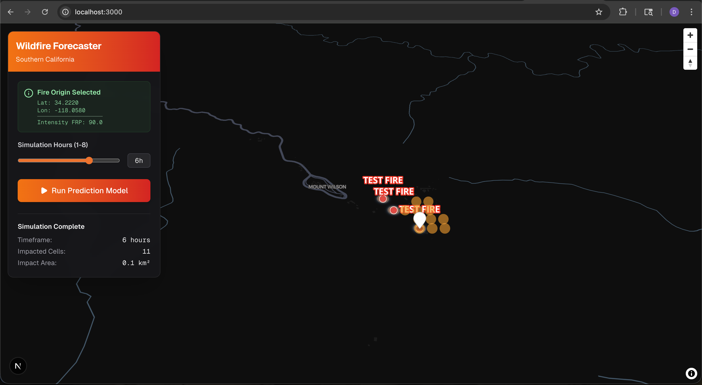

# Wildfire Spread Forecaster

The **Wildfire Spread Forecaster** predicts where an active wildfire will spread over the next 6–24 hours based on its current location, size, shape, near real-time satellite data, weather forecasts, and terrain/vegetation conditions. Focused initially on Southern California, this application combines real-time data ingestion with an empirically-driven modeling engine to provide vital predictive insights on an interactive 3D map.

## App Screenshots

  

*Initial view of the Wildfire Spread Forecaster landing page centered on Southern California.*



*Example simulation predicting a fire's spread footprint over a 6-hour period.*


## Key Features

*   **Predictive Modeling Engine:** Utilizes an empirically-driven Cellular Automata algorithm inspired by the Rothermel fire spread equation, seamlessly integrating variables like base spread, wind speed/direction, and topological elevation changes across a 100m grid.
*   **Live Data Integration:**
    *   **NASA FIRMS (MODIS/VIIRS):** Fetches real-time active fire clusters.
    *   **NOAA HRRR / NWS:** Retrieves hourly wind speed and direction forecasts.
    *   **USGS 3DEP:** Incorporates precise on-demand elevation data for slope calculations.
*   **Interactive 3D Visualization:** A Next.js frontend built with open-source **Maplibre GL JS** offering high-performance, 3D terrain visualization out-of-the-box (with a 2.5x exaggeration to highlight topology).
*   **Control Panel:** Integrated UI sidebar allowing users to select prediction parameters and simulate up to 8 hours of anticipated fire spread.
*   **Asynchronous Processing:** Powered by Python `asyncio`, ensuring high prediction speeds via concurrent data fetching and smart caching mechanisms without overwhelming upstream APIs.

## Tech Stack & Architecture

### Backend / Data Processing
*   **Framework:** Python (FastAPI)
*   **External APIs:** NASA FIRMS, NOAA HRRR (NWS), USGS 3DEP Server

### Frontend / User Interface
*   **Framework:** Next.js / React
*   **Styling:** Tailwind CSS
*   **Mapping:** Maplibre GL JS (with CARTO Dark Matter styles and open terrain DEM)

### Infrastructure (Target)
*   **Deployment Strategy:** AWS Serverless Architecture (AWS Lambda, API Gateway) to optimize for the AWS Free Tier.

## Getting Started

To run the Wildfire Spread Forecaster locally, you will need to start both the Python FastApi backend and the Next.js frontend.

### Prerequisites
- Node.js (for the frontend)
- Python 3.8+ (for the backend)

### 1. Setting Up the Backend

The backend is built with FastAPI and runs the cellular automata spread model.

```bash
# Navigate to the backend directory
cd backend

# Create and activate a virtual environment (if not already done)
# This uses the venv directory at the root level of the project
python -m venv ../venv
source ../venv/bin/activate  # On Windows, use `..\venv\Scripts\activate`

# Install dependencies
pip install -r requirements.txt # (Make sure you install the necessary packages)

# Run the FastAPI server natively via Uvicorn
python -m uvicorn app:app --reload
```

*Note: The backend defaults to port 8000. It supports an environment variable `USE_MOCK_FIRES="true"` to forcefully inject a mock fire cluster if the NASA FIRMS API returns no active fires in the region.*

### 2. Setting Up the Frontend

The frontend is a Next.js application that renders the Maplibre 3D interface.

```bash
# Open a new terminal and navigate to the frontend directory
cd frontend

# Install dependencies
npm install

# Run the Next.js development server
npm run dev
```

The application should now be accessible in your web browser, typically at http://localhost:3000. It will automatically proxy API requests to the local backend.
